# Hệ thống quản lý bán vé rạp chiếu phim

## Thông tin chung
- **Tên đề tài:** Quản lý bán vé tại một rạp chiếu phim
- **Công nghệ:** Java (desktop), Swing, JDBC, SQL Server
- **Người thực hiện:**
    - Nguyễn Thị Tường Vi – 21131851
- **Thời gian thực hiện:** 11/11/2025
- **Mục đích:** Dự án học phần, rèn luyện lập trình hướng đối tượng, thiết kế CSDL và xây dựng UI desktop.

---

## Mục tiêu dự án
- Xây dựng hệ thống quản lý rạp chiếu phim hoàn chỉnh, hiện đại, dễ sử dụng, có khả năng mở rộng và bảo trì.
- Đáp ứng các yêu cầu học thuật về:
    - Phân tích yêu cầu, thiết kế CSDL, thiết kế lớp (Class Diagram).
    - Phát triển giao diện desktop bằng Java Swing.
    - Kết nối và thao tác với cơ sở dữ liệu SQL Server thông qua JDBC.

---

## Chức năng chính

### 1. Quản lý phim
- Thêm, sửa, xóa, tìm kiếm phim theo tên hoặc thể loại.
- Upload poster phim, lưu vào thư mục `resources/images/movies/`.
- Hiển thị danh sách phim dạng grid (4 cột), hover hiện thông tin chi tiết.

### 2. Quản lý phòng chiếu và ghế
- Tạo phòng mới, nhập số ghế → hệ thống tự động sinh ghế theo hàng và cột.
- Hỗ trợ 3 loại ghế:
    - Thường (màu xanh)
    - VIP (+20% giá, màu vàng)
    - Couple (2 ghế liền nhau, giá x2, màu hồng)

### 3. Quản lý lịch chiếu
- Tạo lịch chiếu: chọn phim, phòng, ngày, giờ, giá vé cơ bản.
- Kiểm tra trùng lịch (cùng phòng, cùng thời gian).

### 4. Đặt vé
- Chọn lịch chiếu → hiển thị sơ đồ phòng ghế.
- Click ghế để chọn, đổi màu ghế → tính tiền theo loại ghế và vị trí.
- Xác nhận thanh toán → in hóa đơn (text UI hoặc file).

### 5. Quản lý khách hàng và hóa đơn
- Lưu thông tin khách hàng: tên, SĐT, email.
- Theo dõi lịch sử đặt vé, tổng chi tiêu.
- Tự động tính tổng tiền hóa đơn, cập nhật trạng thái thanh toán.

### 6. Thống kê
- Doanh thu theo ngày, tháng, phim, thể loại.
- Số vé bán theo loại ghế.
- Tỷ lệ lấp đầy phòng (%).
- Top 10 khách hàng tiêu biểu.
- Biểu đồ doanh thu dạng cột (custom paint trong Swing).

---

## Cấu trúc cơ sở dữ liệu!
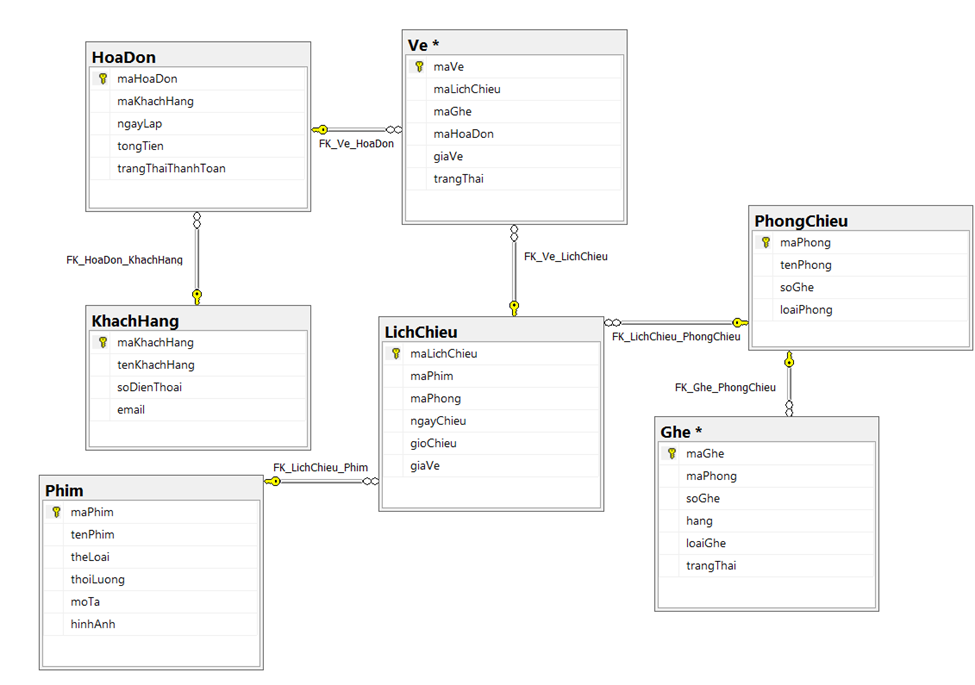
## Mô hình lớp (Class Diagram)
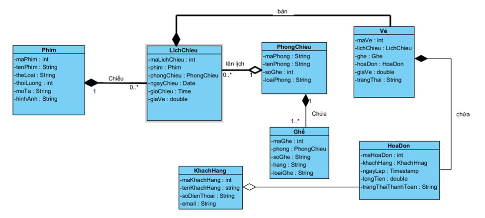
**Các lớp chính thường có:**
- `Phim`, `PhongChieu`, `Ghe`, `LichChieu`, `KhachHang`, `HoaDon`, `Ve`.

---

## Màn hình chương trình chính

### 1. Màn hình chính
- Menu điều hướng: Phim, Phòng chiếu, Lịch chiếu, Đặt vé, Khách hàng, Hóa đơn, Thống kê.
- Giao diện đơn giản, dễ thao tác.
  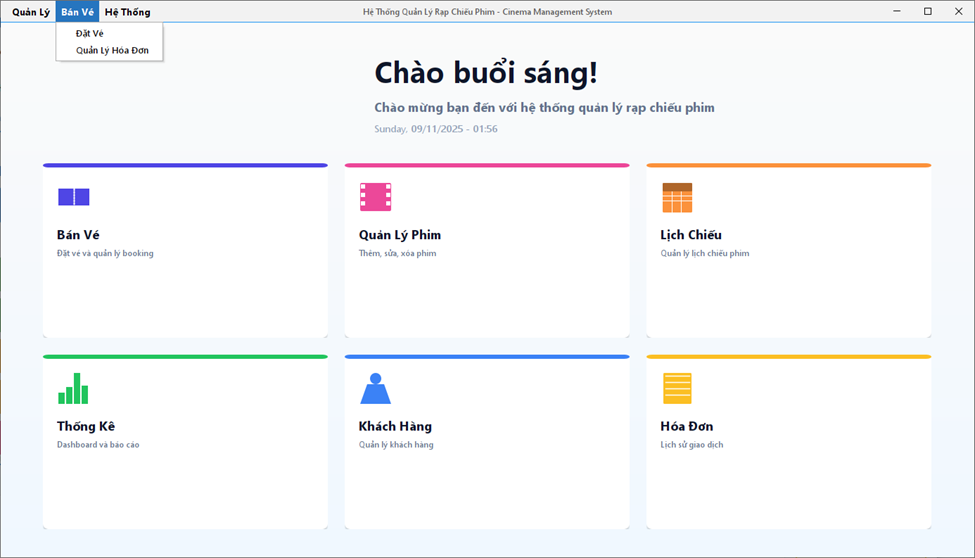
### 2. Màn hình quản lý Phim
- Grid hiển thị danh sách phim, bộ lọc tìm kiếm.
- Nút Thêm / Sửa / Xóa, hỗ trợ upload poster.
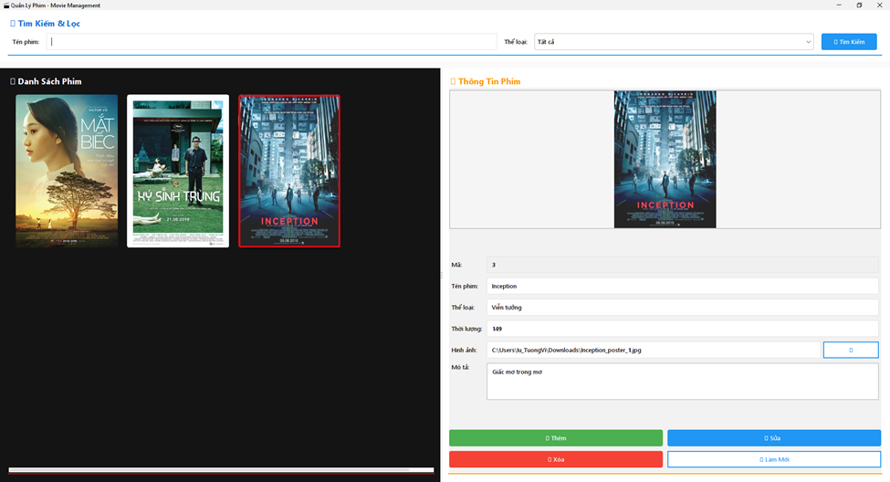
### 3. Màn hình Bán Vé
- Danh sách lịch chiếu → chọn suất.
- Sơ đồ ghế trực quan: màu sắc theo loại ghế.
- Tính tiền real-time, hiển thị tổng tiền.
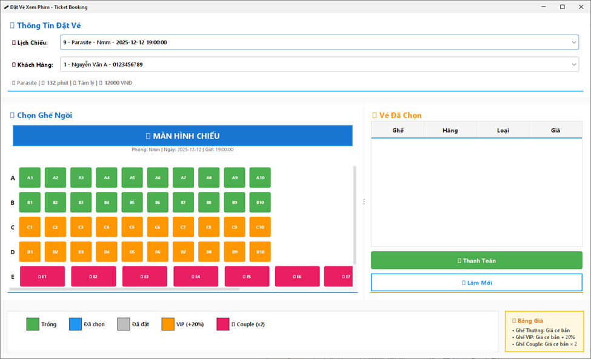
### 4. Màn hình Lịch chiếu
- Bảng lịch chiếu, lọc theo ngày / phim / phòng.
- Chức năng thêm / sửa / xóa lịch.
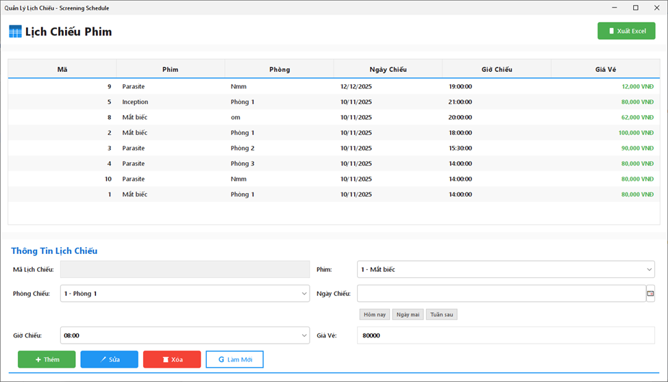
### 5. Màn hình Khách hàng
- Danh sách khách hàng, tìm kiếm theo tên / SĐT.
- Xem lịch sử đặt vé, tổng chi tiêu.
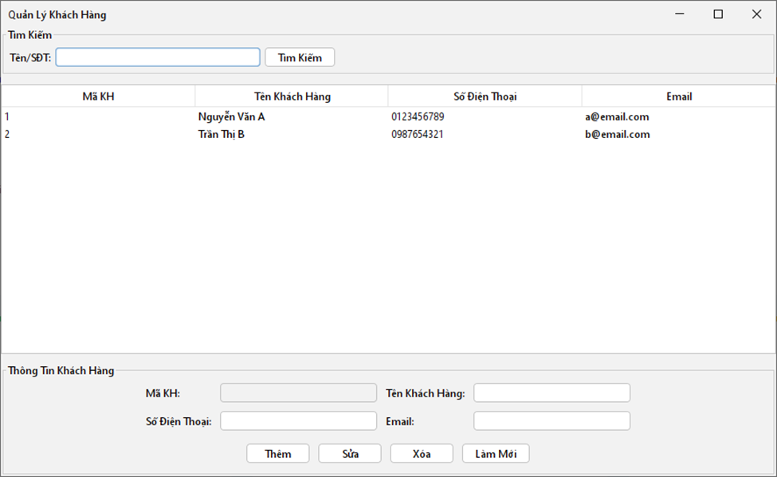
### 6. Màn hình Hóa đơn
- Danh sách hóa đơn, tổng tiền, trạng thái thanh toán.
- Chi tiết từng vé trong hóa đơn.
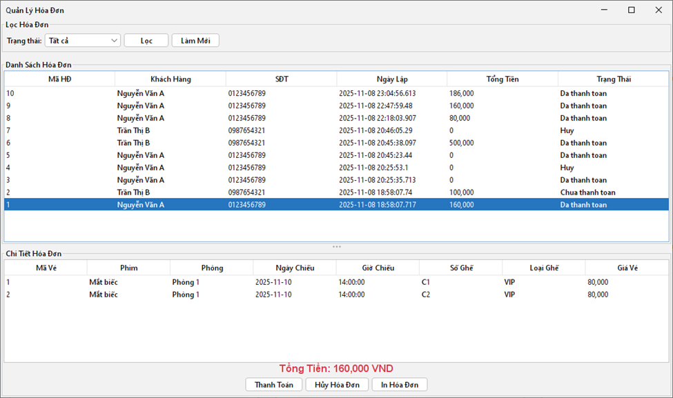
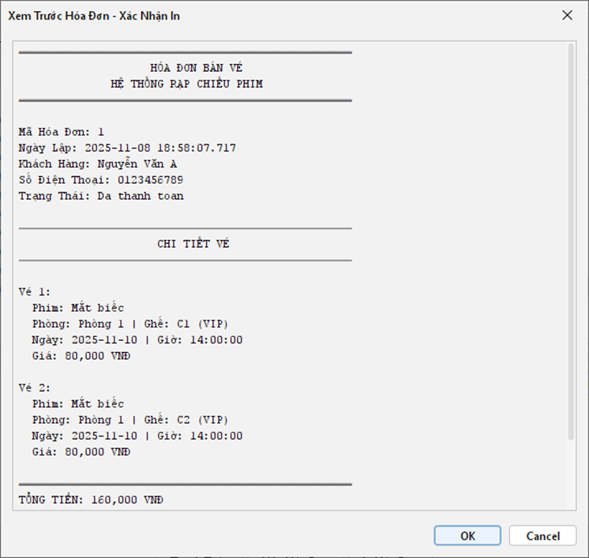
### 7. Màn hình Phòng chiếu
- Danh sách phòng, số ghế, loại phòng (2D/3D/IMAX).
- Thêm / sửa phòng, xem sơ đồ ghế.
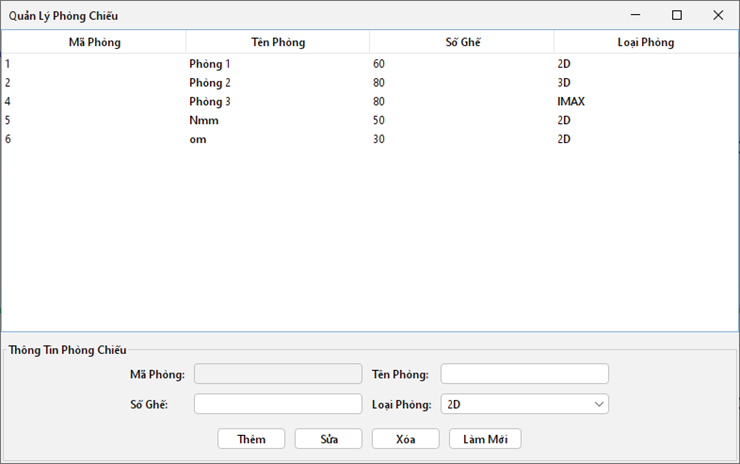
### 8. Màn hình Thống kê
- Biểu đồ cột doanh thu theo thời gian / phim / loại ghế.
- Các chỉ số: doanh thu, số vé, tỷ lệ lấp đầy, top khách hàng.
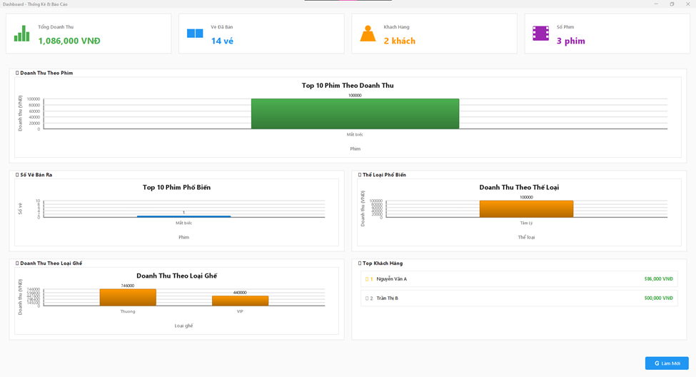
---

## Yêu cầu phi chức năng

- **Hiệu năng:** Thời gian phản hồi các thao tác chính dưới 1 giây.
- **Bảo mật:** Kiểm tra đầu vào, thiết kế SQL bằng PreparedStatement để giảm thiểu SQL injection.
- **Tính toàn vẹn:** Sử dụng trigger để cập nhật tự động các trường liên quan (ví dụ: tổng tiền hóa đơn, số vé đã bán).
- **Khả năng mở rộng:** Thiết kế module hóa, phân lớp rõ ràng (UI, DAO, Business Logic).
- **Giao diện:** Responsive trên nhiều độ phân giải, dễ sử dụng cho người quản lý và nhân viên bán vé.

---
